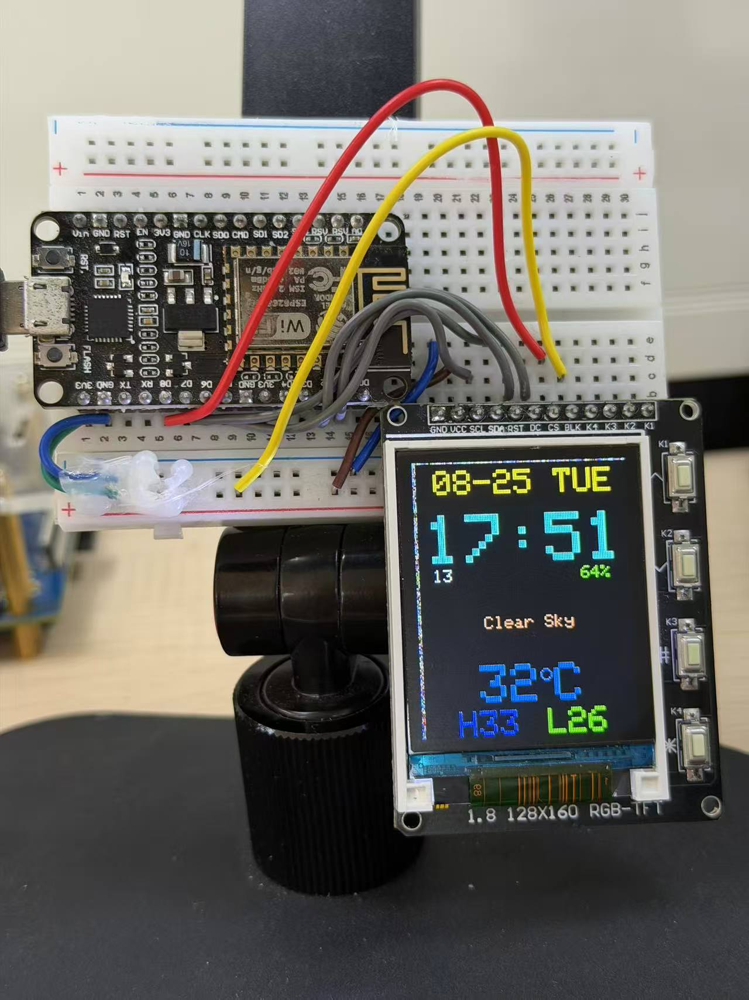

# ESP8266_LCD_Weather

ESP8266 + ST7735S 1.8 寸（128x160）屏幕天气时钟：手机一键配网，屏幕显示**日期、时间、天气描述、当前温度、湿度、当日最高/最低温度**。

## 功能

1. **SmartConfig 配网**：手机 Esptouch App / 微信小程序一键发送 WiFi 密码，ESP8266 自动连接并**记住 WiFi，下次开机直连**
2. **NTP 网络对时**：显示 日期 / 星期 / 时间（默认北京时间 UTC+8）
3. **天气获取**：**Open-Meteo**（免费免 key，响应仅 ~700 字节，稳定解析），显示 天气描述 / 当前温度（°C）/ 湿度 / **当日最高温度（红）· 最低温度（绿）**，每 10 分钟自动刷新
4. **ST7735S 屏幕显示**：128x160 竖屏，**局部刷新不闪烁 + 彩色界面**

## 硬件接线（NodeMCU 丝印）

| TFT (ST7735S) | NodeMCU | GPIO |
|---------------|---------|------|
| VCC | 3V3 | - |
| GND | GND | - |
| SCL / SCK | D5 | GPIO14 |
| SDA / MOSI | D7 | GPIO13 |
| CS | D8 | GPIO15 |
| DC / A0 | D1 | GPIO5 |
| RST | D2 | GPIO4 |
| BL | 3V3（常亮） | - |

> VCC 建议接 **3V3**。

## 手机配网步骤

> 首次使用必做；只支持 **2.4G WiFi**（ESP8266 不支持 5G）。

1. 手机连接自家的 2.4G WiFi
2. 手机安装 **Esptouch** App（乐鑫官方）或微信小程序 "Esptouch"
3. 打开 App，输入当前 WiFi 的密码，点**发送/开始**
4. 板子自动连接，屏幕出现日期时间和天气

配网信息保存在 flash，以后开机自动连接。

## 界面布局（128x160 竖屏，彩色）

```
08-19 TUE       ← 日期+星期（青色）
14:35           ← 时间（黄色，大字）
20   62%        ← 秒（白）+ 湿度（绿）
Partly Cloudy   ← 天气描述（天蓝）
31°C            ← 当前温度（橙色大字，°符号自绘）
H33   L24       ← 当日最高（红）/ 最低（绿）
```



## 可配置项（`ESP8266_LCD_Weather.ino` 顶部）

| 常量 | 含义 | 默认 |
|------|------|------|
| `LAT` / `LON` | 你所在城市的经纬度（百度搜"城市名 经纬度"）；改成自己城市天气才准 | 31.82 / 117.28（合肥） |
| `TIMEZONE` | 时区偏移（小时） | `8` |
| `WEATHER_INTERVAL` | 天气刷新间隔（秒） | `600` |

## 编译与烧录

依赖库已安装（**ArduinoJson 7.4.3** + Adafruit GFX + Adafruit ST7735，均装在你电脑的 `~/Arduino`）。

```bash
cd ESP8266_LCD_Weather
./build_flash.sh          # 一条命令：自动查找工程 -> 编译 -> 检测串口 -> 烧录
```

或纯烧录（有 .bin 时）：`./flash_esp8266.sh`
或 Arduino IDE：打开 `.ino` → 开发板选 "NodeMCU 1.0 (ESP-12E Module)" → 端口 → 上传

## 常见问题

- **屏幕偏色 / 边缘彩带**：ST7735S 各厂家面板偏移不同，把固件里 `tft.initR(INITR_18GREENTAB)` 依次换成：
  `INITR_18REDTAB` → `INITR_GREENTAB` → `INITR_REDTAB` → `INITR_BLACKTAB`，试到边缘无彩带、颜色正常为止。
- **天气显示 `--`**：Open-Meteo 不可达或解析失败（国内网络到 open-meteo 偶尔慢），检查网络后等下一次自动刷新（10 分钟）；可尝试把 `http.begin(wclient, url)` 的请求域名换成镜像或手动在浏览器测试 URL 可达性。
- **显示的城市天气不对**：`LAT/LON` 填了你所在城市的坐标吗？（默认是合肥）
- **配网失败**：确认手机连的是 2.4G WiFi；配网超时 120 秒后板子自动重启重新等待。
- **时间是 1970 年**：NTP 服务器不可达，检查网络；可换 `NTP_SERVER1`。

## 文件结构

```
ESP8266_LCD_Weather/
├── ESP8266_LCD_Weather.ino    # 主程序
├── build_flash.sh             # 通用「编译+烧录」脚本
├── flash_esp8266.sh           # 纯烧录脚本
└── README.md
```